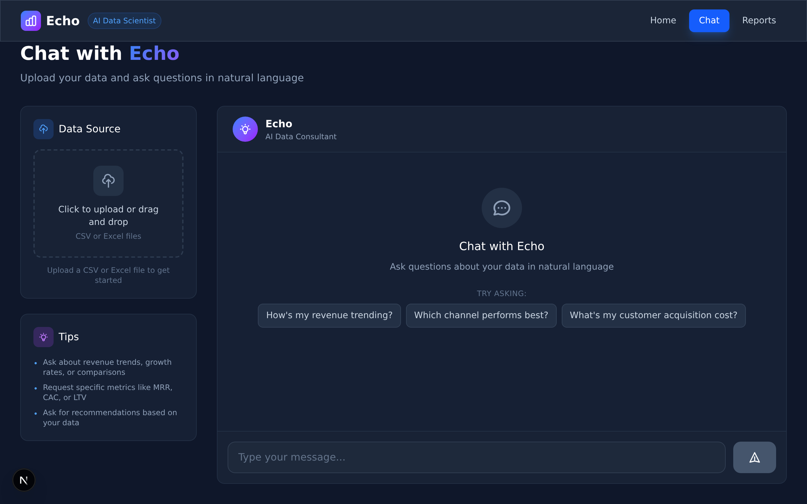
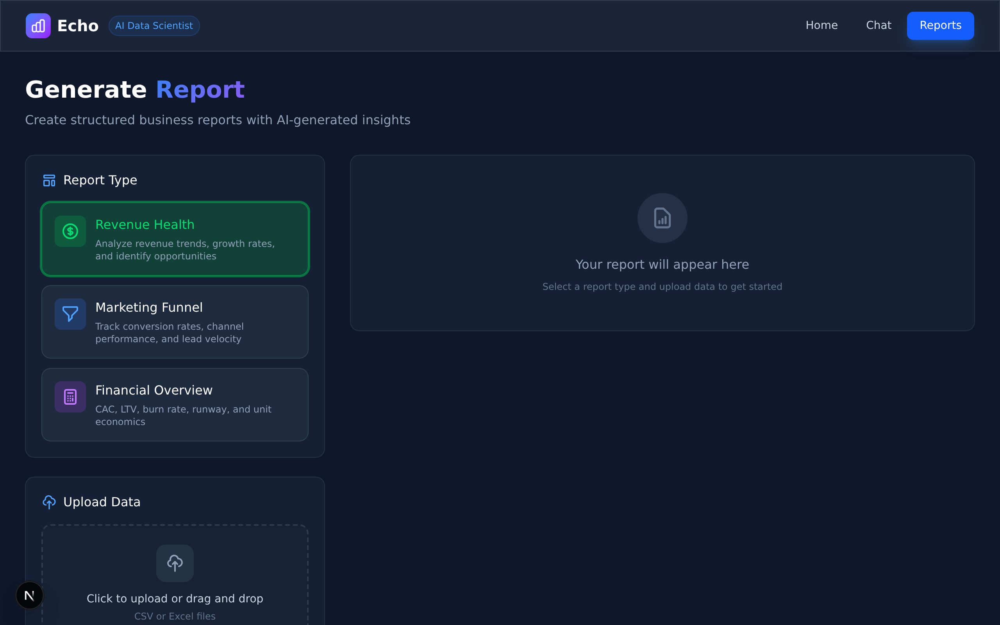

# Echo

AI-powered analytics for small businesses. Turn messy CSVs into clear insights in minutes, not hours.


## What It Does

- Cleans and validates raw business data automatically (dates, currency, booleans, column names)
- Computes 20+ business metrics deterministically (MRR, ARR, CAC, LTV, conversion funnels)
- Generates plain-English reports powered by an LLM that never does the math
- Runs A/B test analysis with z-tests, confidence intervals, and power analysis

## Why It Exists

Small teams drown in spreadsheets but can't hire a data scientist. Echo gives them one in the browser.

The core idea: **deterministic metrics + LLM narrative**. I don't trust LLMs to do calculations. They're great at explaining things, terrible at math. So the numbers come from tested Python code, and the AI only writes the narrative.

## Screenshots

| Upload and Metrics | Chat Interface | Report Templates |
|:------------------:|:--------------:|:----------------:|
|  |  |  |

---

## Skills Demonstrated

### Data Science and Experimentation
- Designed and implemented a two-proportion z-test engine (conversion rates, lift, p-value, power analysis)
- Built an experimentation API: hypothesis to variants to statistical decision
- Created a portfolio-grade Jupyter notebook for A/B test analysis (`notebooks/funnel_ab_test_analysis.ipynb`)

### Analytics Engineering
- Built a schema detector for mixed-format business CSVs (dates, currency, booleans, URLs, emails)
- Implemented a DataAutoFixer that normalizes messy columns before analysis
- Designed a deterministic metrics engine for 20+ business metrics with 225 automated tests

### Backend Engineering
- REST API with FastAPI: ingestion, metrics, chat, reports, analytics, experiments
- PostgreSQL for persistence, Redis for caching
- Telemetry middleware that tracks time saved, accuracy, and usage
- 78% test coverage

### Frontend
- Next.js 15 with TypeScript and Tailwind CSS
- File upload with drag-and-drop, real-time metric display
- Data type detection badges, error handling, responsive design

---

## Outcomes

Echo replaces a 2-hour manual spreadsheet workflow with a 15-minute guided flow.

The evaluation layer tracks:
- Average time saved per analysis (baseline vs actual)
- Insight accuracy as rated by users
- Satisfaction scores on generated reports

Example metrics from test usage:
- **1.85 hours saved** per analysis on average
- **4.3/5 satisfaction** across 150+ feedback events
- **94% accuracy** on insights marked by users

---

## Case Study: Should We Ship the New Onboarding Flow?

**Situation**: A SaaS company ran an A/B test on their onboarding. Control had 60% activation, variant had 80%. Is this real or noise?

**What Echo does**:
1. Upload the experiment results CSV
2. Echo calculates: 33% relative lift, p-value = 0.002, statistically significant
3. Decision: "Ship variant. Statistically significant positive effect with high confidence."

**Outcome**: Clear recommendation backed by numbers, not gut feeling.


The notebook walks through the full analysis: funnel visualization, two-proportion z-test, confidence intervals, and business impact projection.

See the full walkthrough: `notebooks/funnel_ab_test_analysis.ipynb`

---

## Architecture

```
Frontend     Next.js 15, React, TypeScript, Tailwind
API          FastAPI (Python 3.11), structured routers per domain
Database     PostgreSQL 15 for storage, Redis 7 for caching
LLM          DeepSeek via OpenAI-compatible API (explanations only)
Testing      pytest, 225 tests, 78% coverage
```

```
echo/
├── app/                    # Backend
│   ├── api/v1/            # REST endpoints
│   ├── services/          # Business logic
│   │   ├── metrics/       # Revenue, marketing, financial metrics
│   │   ├── experiments/   # A/B testing and statistics
│   │   ├── llm/           # Conversation and context
│   │   └── reports/       # Report generation
│   └── models/            # Database models
├── frontend/              # Next.js app
│   ├── app/               # Pages (home, chat, reports)
│   └── components/        # Reusable UI components
├── notebooks/             # Analysis notebooks
└── tests/                 # Test suite
```

---

## Quickstart

### Prerequisites
- Docker and Docker Compose
- Node.js 18+
- DeepSeek or OpenAI API key

### Run locally

```bash
# 1. Clone and configure
git clone https://github.com/yourusername/echo.git
cd echo
cp .env.example .env
# Add your DEEPSEEK_API_KEY to .env

# 2. Start backend
docker-compose up -d

# 3. Start frontend
cd frontend
npm install
npm run dev

# 4. Open http://localhost:3000
# Upload data/samples/revenue_sample.csv to test
```

Backend API docs: http://localhost:8000/docs

---

## API Overview

### Metrics
```
POST /api/v1/metrics/calculate/csv    Calculate metrics from uploaded file
GET  /api/v1/metrics/available        List available metrics
```

### Chat
```
POST /api/v1/chat                     Send message to Echo
POST /api/v1/chat/with-data           Chat with file upload
```

### Reports
```
POST /api/v1/reports/generate         Generate structured report
GET  /api/v1/reports/templates        List report templates
```

### Experiments
```
POST /api/v1/experiments              Create experiment
POST /api/v1/experiments/{id}/results Submit variant results
GET  /api/v1/experiments/{id}/summary Get statistical analysis
```

### Analytics
```
POST /api/v1/analytics/session/start  Start tracking session
POST /api/v1/analytics/session/end    End session, calculate time saved
GET  /api/v1/analytics/portfolio      Get impact metrics
```

---

## Running Tests

```bash
# Run all tests
docker-compose exec app pytest

# With coverage
docker-compose exec app pytest --cov=app --cov-report=term-missing

# Specific test file
docker-compose exec app pytest tests/services/experiments/test_stats.py -v
```

---

## Development Log

<details>
<summary>Click to expand development history</summary>

### 2025-12-02 - Data Intelligence Layer
Built the DataAutoFixer service that cleans messy data before analysis. Handles whitespace, currency symbols, date formats, boolean standardization, and column name normalization. Added smart data type detection so Echo only calculates relevant metrics.

### 2025-11-30 - Experimentation Platform
Added full A/B testing capabilities. Implemented two-proportion z-test, confidence intervals, power analysis, and automatic decision logic. Created 8 new API endpoints and a portfolio Jupyter notebook.

### 2025-11-29 - Frontend Fixes
Fixed Codespaces networking issues by creating an API proxy route. Updated chat endpoint to handle response fields correctly.

### 2025-11-25 - Evaluation System
Built session tracking, time savings calculation, feedback collection, and the portfolio stats endpoint. Added telemetry middleware for automatic request logging.

### 2025-11-25 - Report Generation
Finished report generation system with 3 templates (Revenue Health, Marketing Funnel, Financial Overview). Each report includes executive summary, key findings, detailed analysis, and recommendations.

### 2025-11-24 - Conversational AI
Built the Echo persona - a data consultant that explains metrics in plain English. Added session management and data context injection.

### 2025-11-23 - Analytics Engine
Implemented 20 deterministic business metrics across revenue, financial, and marketing categories. All verified against manual calculations.

### 2025-11-22 - Data Ingestion
Built schema detection, validation engine, and file upload endpoints. Handles CSV and Excel files.

### 2025-11-19 - Foundation
Set up Docker environment, FastAPI, PostgreSQL, Redis, and DeepSeek integration.

</details>

---


## License
MIT License — free for personal and commercial use.

---

## Contact

Questions or feedback? Open an issue or reach out directly.
